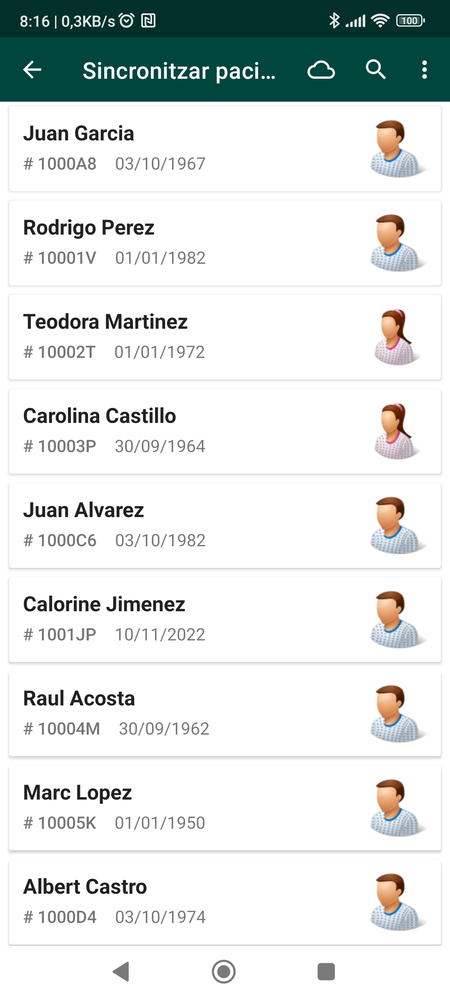
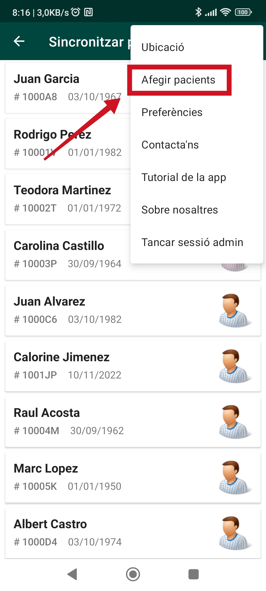
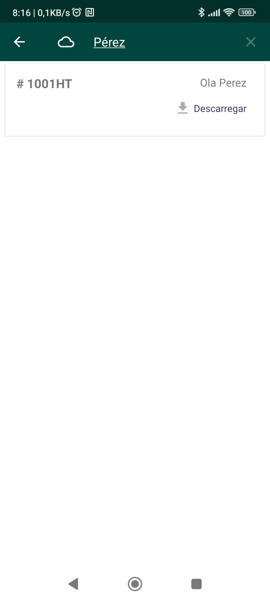

## Descarregar pacients del servidor

Si en comptes de crear un pacient de zero sabeu que aquest pacient ja ha estat creat i el voleu descarregar des del servidor, heu d'accedir a la secció **Cercar Pacients** del menú principal.

Allà veureu la llista de pacients que teniu descarregats a la memòria local de l'aplicació.

Per descarregar un pacient nou del servidor, heu de fer click al menú superior i sel·leccionar l'entrada **Afegir pacients**

Un cop a la nova pantalla, podeu fer click a la icona de la lupa i fer la cerca del pacient per nom, cognoms o identificador. Un cop trobat, el podreu descarregar.

