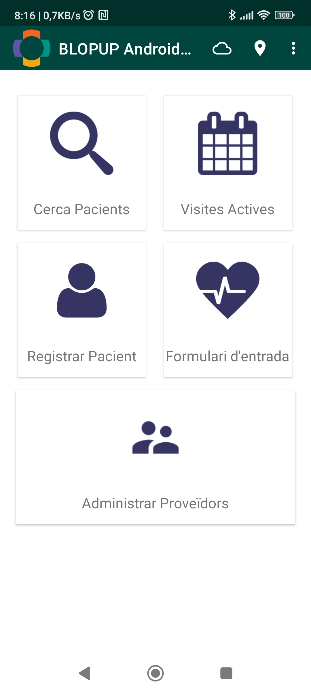
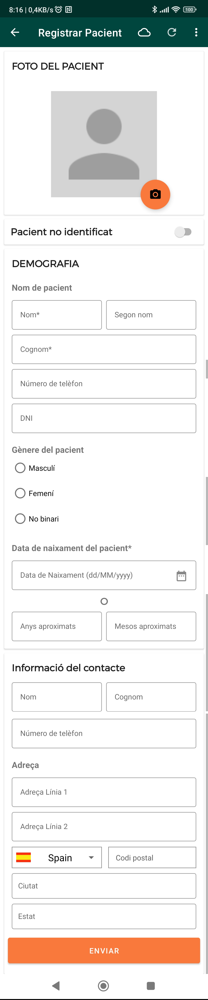
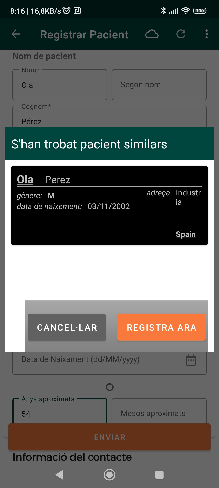

## Registrar un pacient

Podeu registrar un nou pacient a la secció **Registrar pacient** al menú principal.

#### 1. Introduint les dades del pacient

A la pantalla de creació de pacient podeu introduir les dades de contacte bàsiques del pacient. Les dades obligatòries són el nom i cognoms, la data de naixement o edat estimada i el gènere. Un cop omplert el formulario, podeu prèmer el botó **ENVIAR**.

Un cop creat el pacient, navegareu cap a la pantalla de detalls del pacient. Allà podeu editar-lo amb el botó del llapis o veure les dades del pacient, com ara les visites que ha realitzat o l'històric de constants vitals.

#### 2. Pacients similars

Quan es registra un pacient, el sistema comprova que no s'hagi registrat anteriorment. Si troba un pacient amb dades similars, abans de poder guardar us demanarà que confirmeu que és un pacient nou. En el cas que estigueu intentant registrar un pacient que ja existeix, cancel·leu l'operació i [descarregueu el pacient del servidor](download-patient.md).

