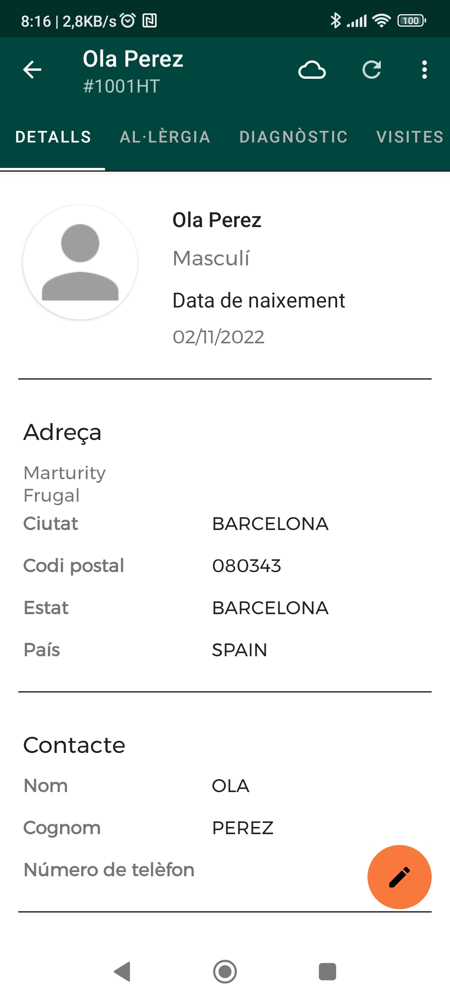
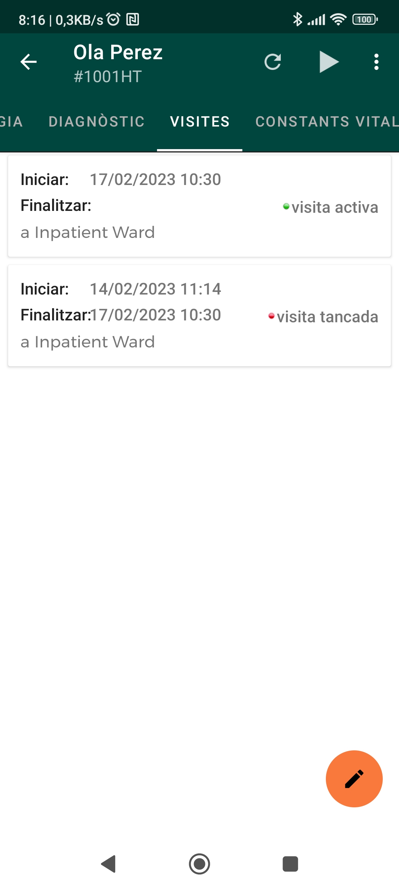
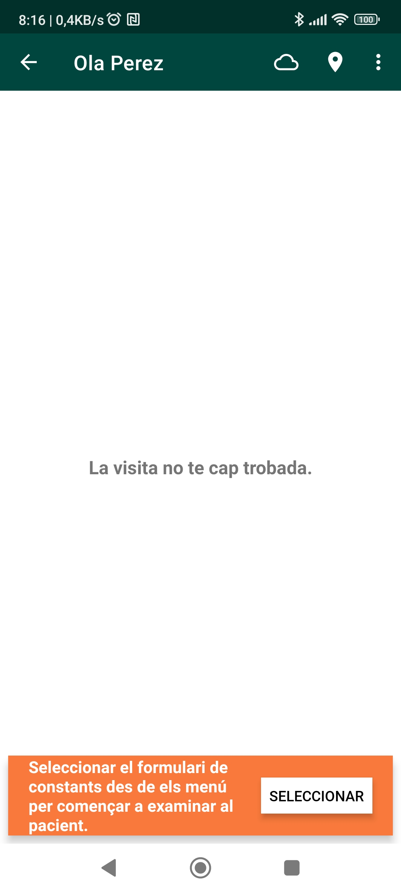
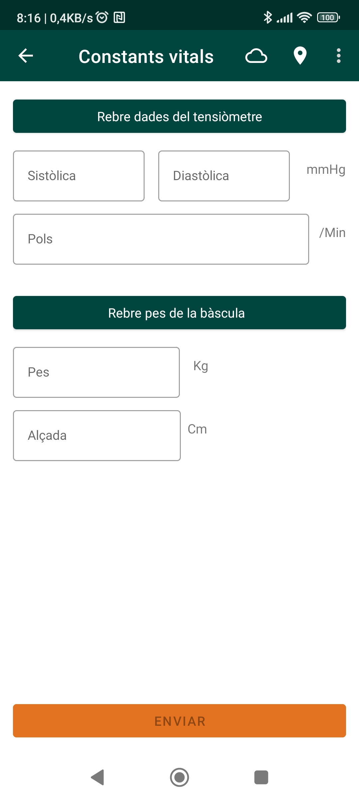
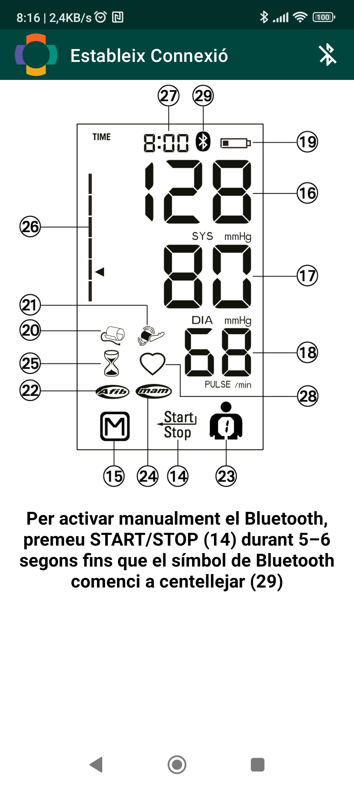
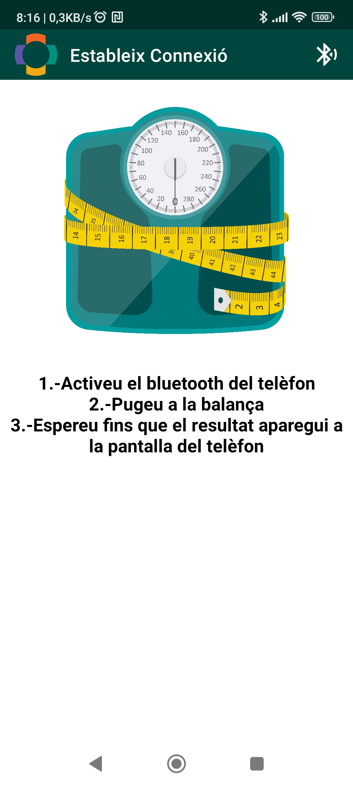
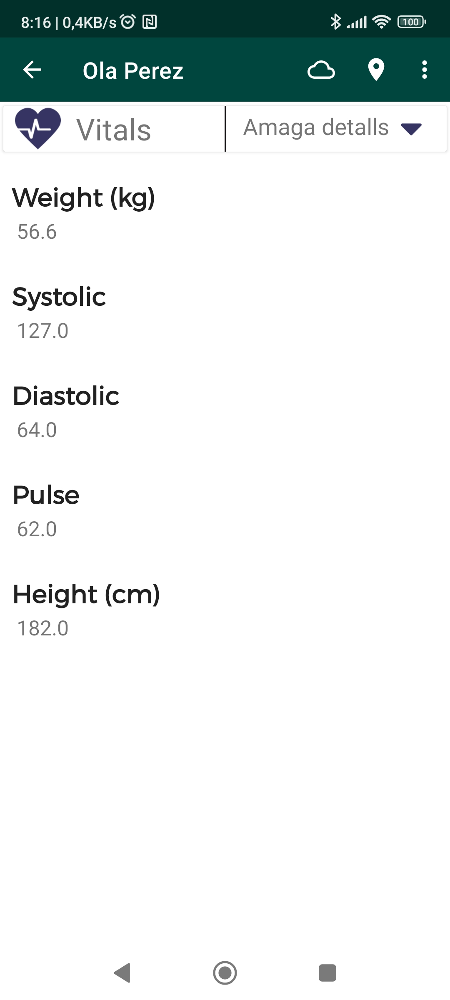

## Prendre constants vitals

Per prendre les constanst vitals d'un pacient, heu d'entrar a la fitxa del pacient i accedir a la pestanya de visites.

En aquesta pantalla, veureu si el pacient té cap visita antiga o activa. Per prendre les constants vitals, s'ha de fer des d'una visita activa. En el cas que hagueu de començar una nova visita, feu click al botó del triangle al menú superior.

Un cop a dins de la visita, si encara no s'han pres mesures, veureu un missatge demanant-vos que prengueu les constants del pacient. Per fer-ho, podeu fer click al botó **SELECCIONAR**.

El formulari per prendre les constants del pacient s'obrirà. Aquí heu de fer servir els botons **Rebre dades del tensiòmetre** i **Rebre pes de la bàscula** per poder sincronitzar amb els dispositius via bluetooth i obtenir les dades de pressió sanguínia i pes, respectivament. L'alçada del pacient s'ha d'introduir manualment a la casella corresponent.

Aquesta és la pantalla amb les instruccions per rebre les dades de pressió sanguínia del tensiòmetre:

Aquesta és la pantalla amb les instruccions per rebre el pes de la bàscula.

Un cop heu pres les mesures, podeu fer click al botó **ENVIAR**. Tornareu a la pantalla anterior i podreu veure les mesures registrades.

