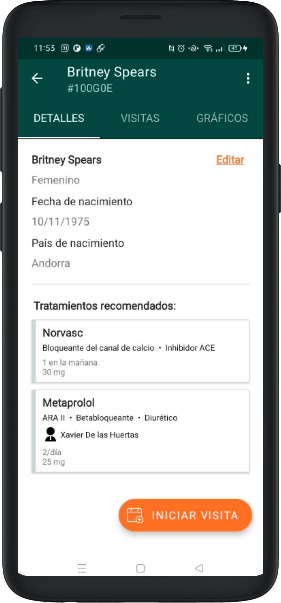
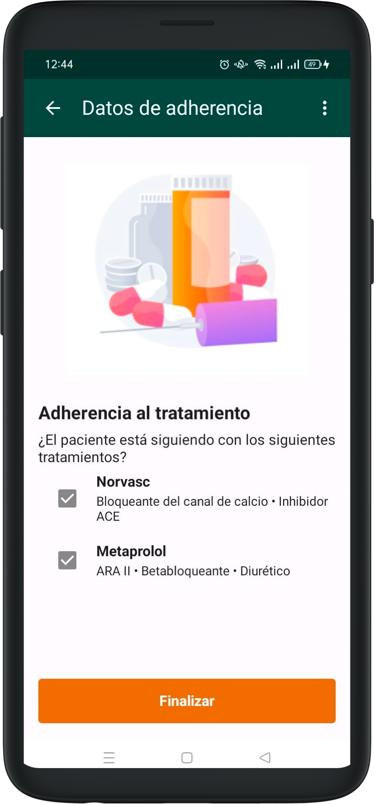

# Adherència

Un cop associats els tractaments al pacient, podem actuar sobre la seva adherència. Això afecta algunes seccions de l'aplicació.

Si el pacient torna per a una altra visita en el futur, podrem veure els tractaments associats abans de començar una nova visita.

La presa de constants vitals inclourà una pantalla addicional per documentar l’adherència. Preguntarem al pacient quins tractaments continua prenent i marcarem les caselles corresponents segons la seva resposta.
