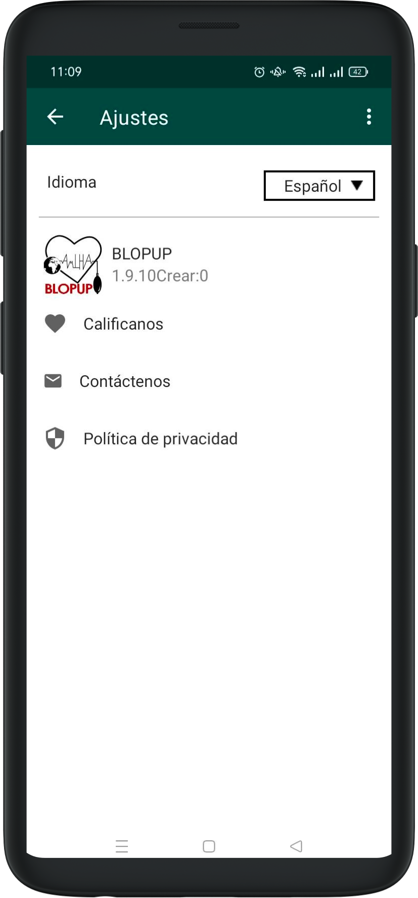

# Configuració

Per canviar l'idioma que es mostra a l'aplicació, cal seleccionar la icona a la part superior dreta de la pantalla, triar Ajustos, obrir el desplegable d'idiomes, seleccionar l'idioma desitjat i prémer Aplicar.

Per tancar la sessió, cal seleccionar la icona a la part superior dreta de la pantalla, triar Tancar sessió admin i prémer el botó taronja de Tancar sessió.
    

