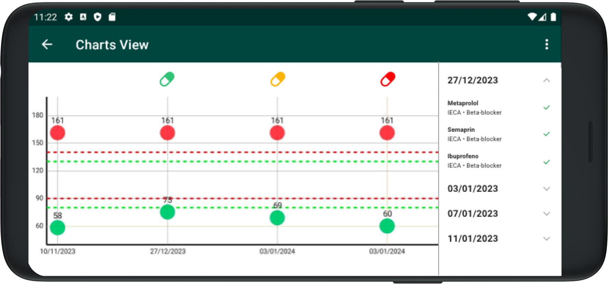

# Gràfics

Als gràfics de cada pacient documentem l’evolució de la seva pressió arterial i la seva adherència (o no) als tractaments recomanats.

Per accedir a aquesta secció, seleccionem el pacient desitjat, entrem a la seva fitxa, accedim a la secció de Gràfics i triem “Evolució de la pressió arterial”.

El gràfic es mostra en vista horitzontal.

En el gràfic es resumeixen totes les preses de pressió sistòlica (vermell) i diastòlica (verd) al llarg del temps, ordenades per data.

A la dreta hi ha informació sobre l’adherència ordenada per data. Podem desplegar cada data per veure el detall de cada tractament i si el pacient ha confirmat l’adherència o no aquell dia.

A la part superior es mostra una icona acolorida segons el nivell d’adherència detectat aquell dia:

Verd = adherència completa,
Groc = adherència parcial,
Vermell = cap adherència.
