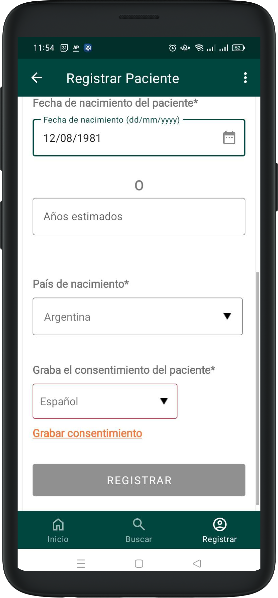
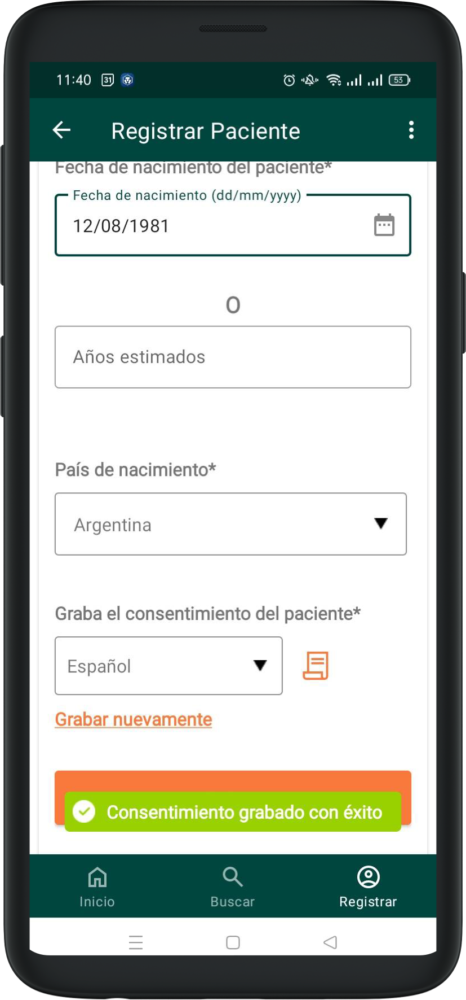

# Registrar Pacient

Podeu registrar un nou pacient a la secció Registrar pacient del menú principal.

A la pantalla de creació del pacient, heu d’introduir les dades de contacte bàsiques del pacient. Totes les dades són obligatòries i estan marcades en vermell.

És possible introduir la data de naixement o l’edat estimada en cas de no disposar d’una data concreta.

## Gravar consentimient

Per poder registrar un pacient, cal gravar el consentiment. Seleccioneu l’idioma del pacient al desplegable i premeu Gravar consentiment.

A la secció de gravació del consentiment hi haurà dos textos: un en l’idioma del mòbil que explica què es pot fer en aquesta secció, i un altre en l’idioma del pacient seleccionat prèviament amb el consentiment legal, que es reproduirà en veu alta un cop premeu el botó Gravar consentiment.

Durant la gravació del consentiment, apareixerà el missatge Gravació en curs a la part superior de la pantalla, indicant que la gravació està activa.

Durant la gravació podeu Pausar-la i reprendre-la tantes vegades com vulgueu. Per fer-ho, premeu Pausar perquè la gravació s’aturi. Quan vulgueu reprendre-la, premeu Continuar. Un cop el pacient hagi donat el consentiment, premeu Aturar i desar gravació.

En tornar a la pantalla de registre, el sistema mostrarà una icona que indica que el consentiment està complet, juntament amb una notificació d’èxit. Si voleu tornar a gravar, premeu Gravar novament.

En omplir el formulari, s’activarà el botó per confirmar la creació del pacient.
