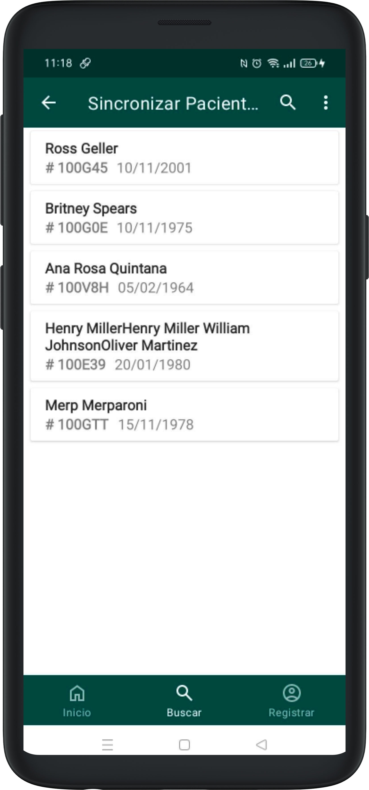

# Buscar pacient

Si en lloc de crear un pacient, sabeu que aquest ja ha estat registrat, heu d’accedir a la secció Cercar pacients del menú principal.

Si ho desitgeu, podeu fer clic a la icona 🔎 i introduir el nom del pacient que voleu cercar. Podeu buscar el nom complet o només les primeres lletres.

Un cop trobeu el pacient, feu clic sobre el seu nom per ser redirigits a la seva fitxa mèdica.
