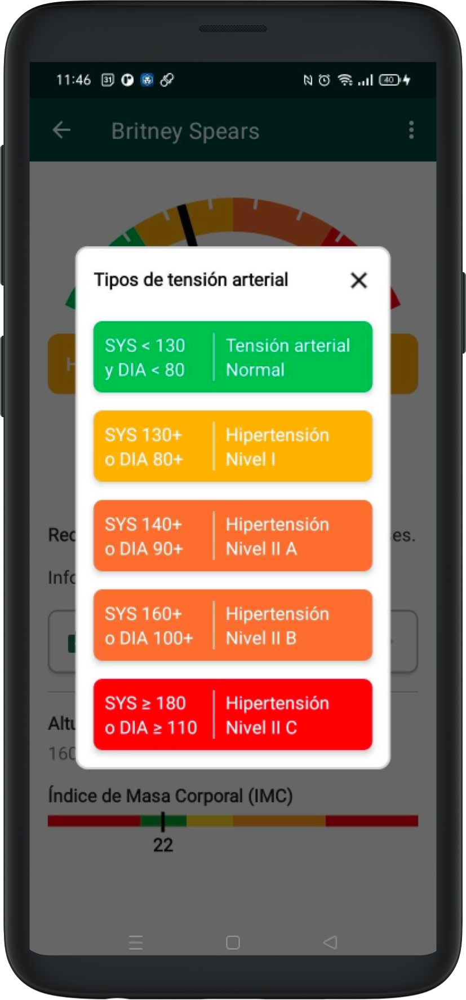
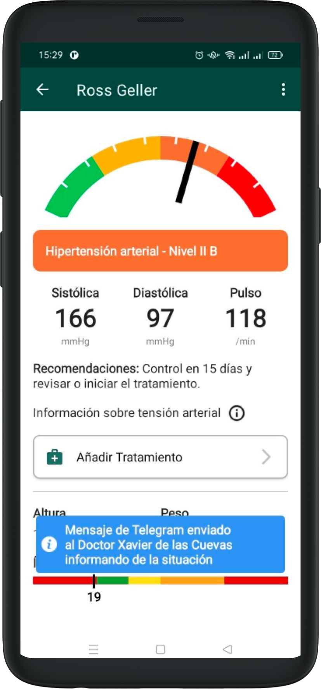
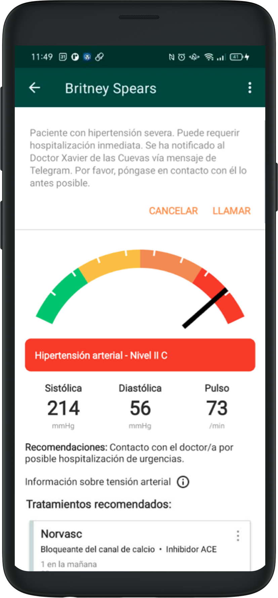

# Resultats

Depenent dels valors mesurats, es determinarà el nivell de tensió arterial.

En cas de voler obtenir més informació sobre cadascun, cal prémer el símbol que desplegarà la informació. Es pot tancar fent clic fora del quadre o a la X.

## Lògica de resultats

Si el pacient es troba amb una Tensió arterial - Normal, una Hipertensió arterial - Nivell I, o una Hipertensió arterial - Nivell II A, el sistema simplement mostrarà la informació i les recomanacions corresponents a cada valor, sense enviar cap notificació al metge de la patologia.

Si el pacient es troba amb una Hipertensió arterial - Nivell II B, el sistema enviarà un missatge per Telegram avisant el metge de la patologia, amb les dades obtingudes i les dades del pacient.

En cas que presenti una Hipertensió arterial - Nivell II C, s’enviarà un missatge per Telegram i també es desplegarà una opció per comunicar-se per telèfon amb el metge.

