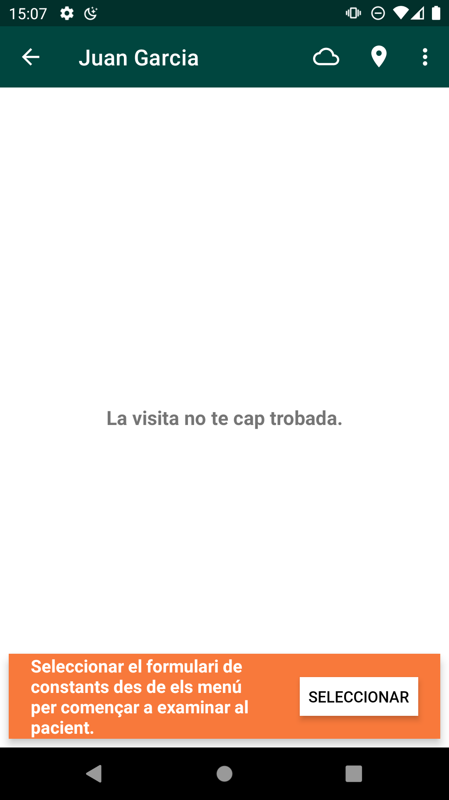
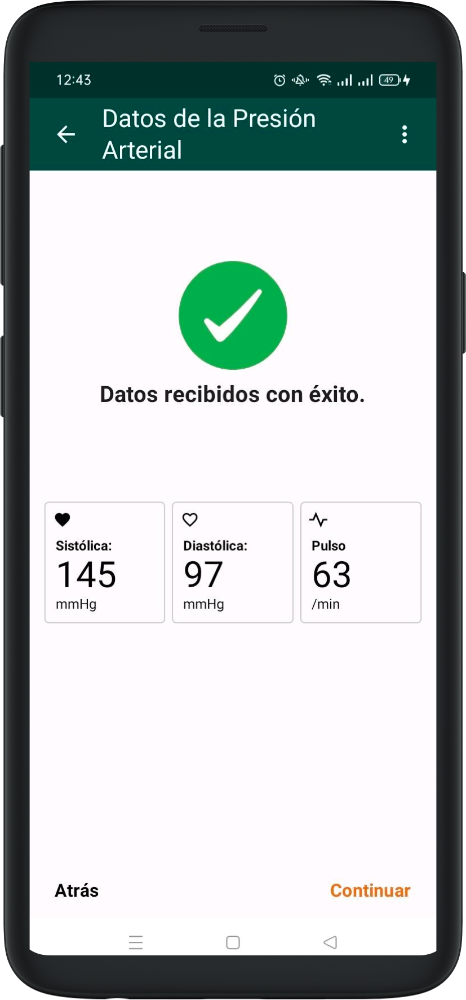
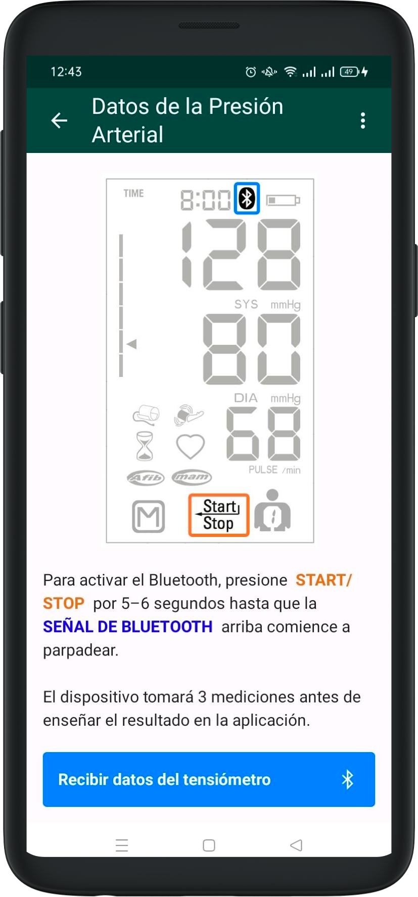
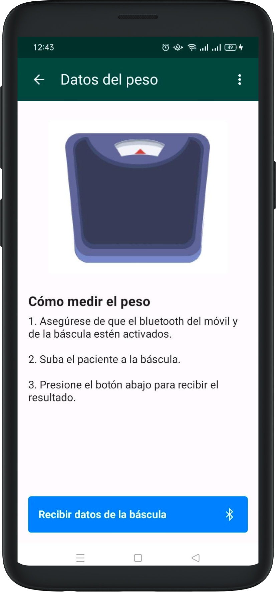
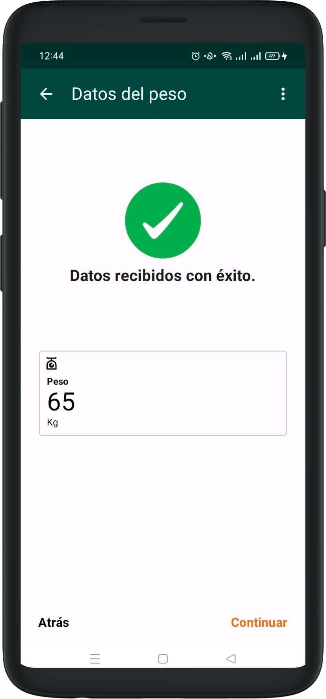
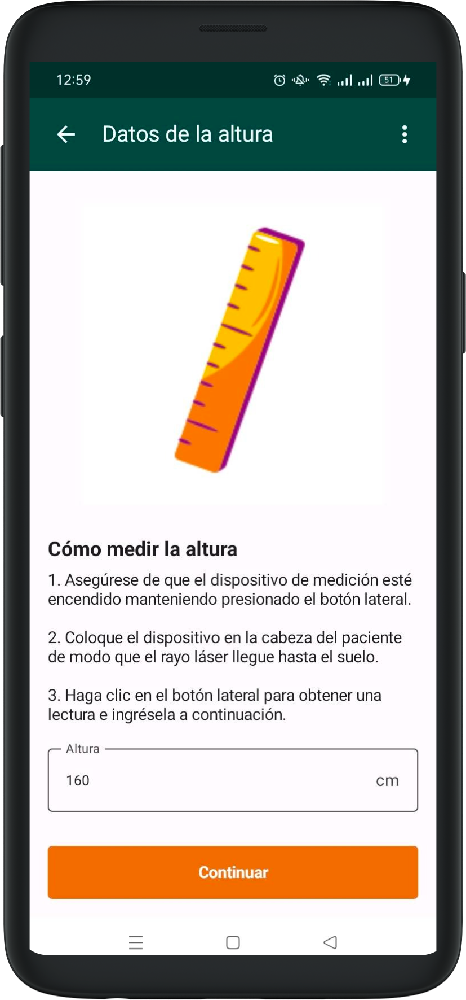

# Presa de vitales

## Pressió Arterial

- Per poder registrar la pressió arterial i el pols, primer cal activar manualment el bluetooth al tensiòmetre.

- Després ja es pot prendre la pressió del pacient i, en finalitzar, apareixerà una pantalla de confirmació amb les dades de la sistòlica, diastòlica i el pols.

- L’aplicació ofereix unes instruccions que es poden llegir en un apartat abans d’iniciar la mesura.

## Bàscula

- Per prendre el pes, assegureu-vos també que el símbol del bluetooth aparegui a la bàscula mentre es pesa el pacient.

L’enviament de dades des de la bàscula és automàtic, però cal corroborar que veiem el símbol. Un cop pres el pes, apareixerà una pantalla de confirmació.

## Alçada

L’alçada s’haurà d’introduir manualment al formulari si és la primera visita del pacient.

Cal prendre la mesura amb l’aparell electrònic corresponent i omplir el camp un cop tinguem el valor.

En futures visites, el valor de l’alçada ja apareixerà escrit al camp corresponent i es podrà editar si cal.

Un cop completada la presa de constants vitals, podrem veure la pantalla [Resultados](results.md)
