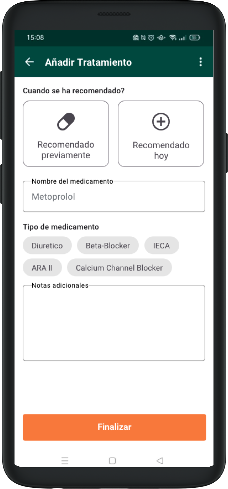
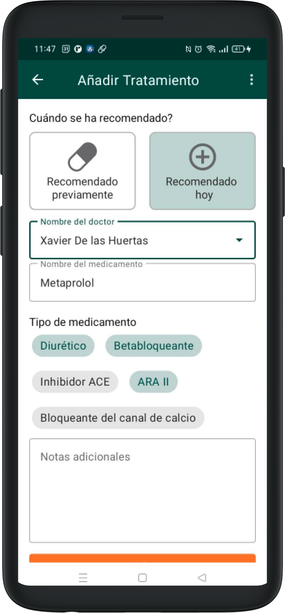

# Tractaments 

## Afegir tractaments 

A la pantalla de resultats de la presa de constants vitals, hi ha un botó que diu “Afegir tractament”. En clicar-hi, accedim a un formulari específic.

Aquest formulari es pot utilitzar per documentar els tractaments recomanats durant la visita, o tractaments previs que el pacient ja està seguint i que volem documentar per a visites futures.

Aquesta informació quedarà registrada i afectarà algunes parts de l’aplicació quan el pacient torni en visites posteriors.

El formulari consta de 4 seccions:
En la primera, marquem si el tractament és preexistent o recomanat durant la visita.
Introduïm el nom del medicament i podem seleccionar tots els tipus de medicament que apliquin (selecció múltiple).
També tenim un camp de text lliure per afegir qualsevol tipus de recordatori o explicació (dosi, freqüència, durada del tractament…).

Si el tractament es recomana avui, tindrem un camp addicional per anotar el nom del metge que l’ha recomanat.

Quan un pacient té tractaments assignats, també podrem documentar la seva [adherencia](adherence.md)

## Editar Tractaments 

### Tractaments actuals 

Tornant a la pantalla de resultats després d’afegir un o més tractaments, cada tractament té una icona a la part superior dreta que desplega un menú contextual. En aquest menú podem interactuar amb cada tractament.

Diferenciem com editar els tractaments segons si s’han afegit el mateix dia o si provenen de recomanacions anteriors.

Si el tractament s’ha afegit el mateix dia, tenim les opcions de tornar a editar el contingut al seu formulari corresponent (per exemple, si hi ha errors) o esborrar-lo completament.

### Tractaments previs 

Un tractament previ no es pot modificar, però es pot Finalitzar. Això el farà invisible en visites futures. Les dades anteriors quedaran guardades.

Si per qualsevol motiu es vol editar un tractament ja en marxa (com canviar la dosi o la freqüència), es recomana finalitzar-lo i afegir-ne un de nou amb informació similar.

En finalitzar el tractament, la casella corresponent es tornarà transparent per indicar que l’operació s’ha completat correctament.
