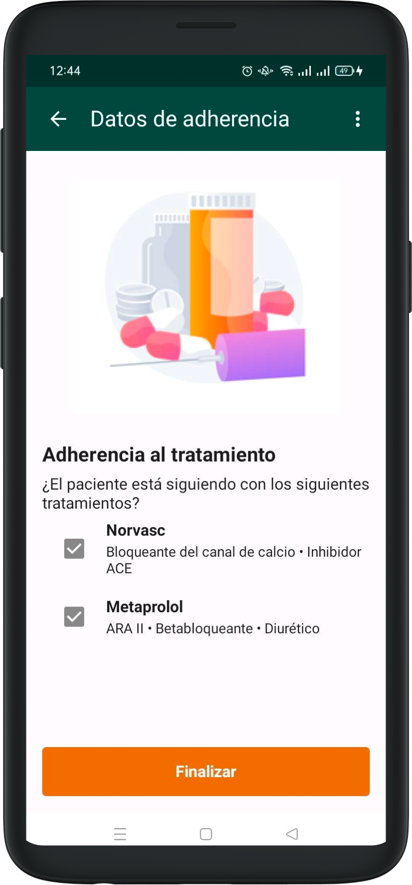

# Adherence

Once treatments are assigned to a patient, we can record their adherence. This affects certain parts of the app. 

When the patient comes back for a future visit, we can see their assigned treatments before the visit starts.

The vitals registration will show an additional screen to document adherence. We'll ask the patient what treatments they're taking and we will mark the corresponding checkbox based on their answers.