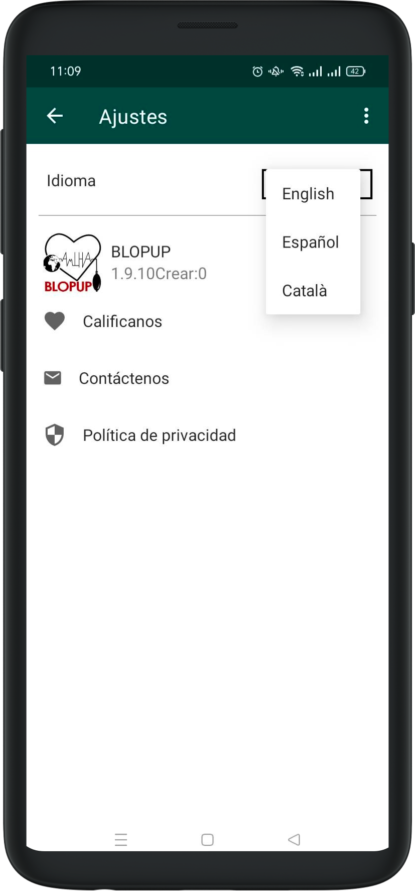

# Configuration

To change the application language, use the icon on the top right of the screen, choose Settings, open the language dropdown, choose the desired language, and click Apply.

To logout, use the icon on the top right, choose Logout admin, and click the orange button to Logout.
    

