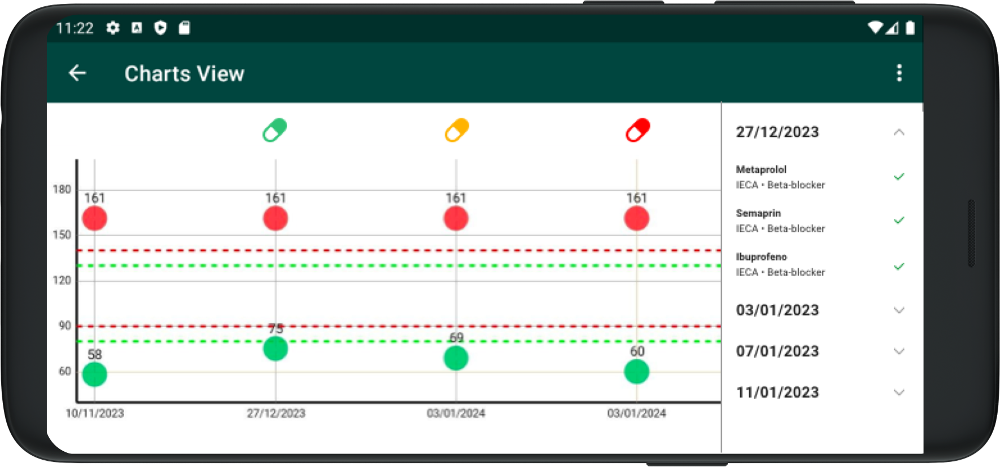

# Graphs

The graphs of each patient document the evolution of their blood pressure and their adherence (or not) to recommended treatment.

To access this section we can pick the desired patient, through their profile we enter the Graphs section and choose "Blood Pressure Evolution"

The graph is displayed in Landscape mode.

With the graph we summarize all blood pressure measurements, systolic (red) and diastolic (green) throughout time, organized by date.

On the right there's a list of all adherence data, sorted by date, where we can expand each date to see the detail of each treatment and whether the patient confirmed adherence or not on that day.

Above each date there's a colored icon that displays the detected level of adherence for that day: Green = complete adherence, Yellow = adherence to some treatments, Red = adherence to none of the treatments.
    
