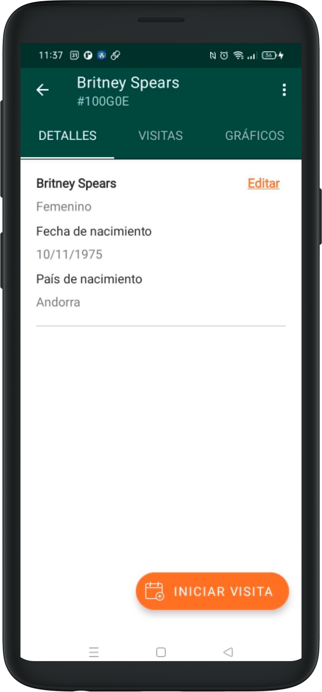

# Patient Registration

You can register a new patient in the Register Patient section in the main menu.

In the Patient creation screen you must enter the patient's basic information. All inputs are mandatory and marked in red.

You can enter birthdate or estimated age in case you don't have a concrete date.

## Recording consent

To register a new patient you'll need to record their consent by voice. Choose the preferred language for the patient in the drop-down, then press Record Legal Consent.

In the Legal Consent Recording section, there are two texts: one in the app language that explains what you can do in this section, and another in the chosen patient languge that explains the legal consent statement, which will be played on speakerphone once you press Record Legal Consent.

While recording the patient's consent, you'll see the message "Recording in Progress" at the top of the screen, signifying that the recording is active.

During the recording you can pause and continue as many times as you'd like. To do that, press on Pause so the recording stops. When you want to resume, press on Continue. Once the patient has given their consent, press on "Stop and Save Recording".

As you return to the Register form, the system will show an icon indicating that the consent recording is complete, along with a notification of success. If you'd like to repeat the recording process, you can click on Record again.

Once the form is complete, the button to create the patient record will activate.

