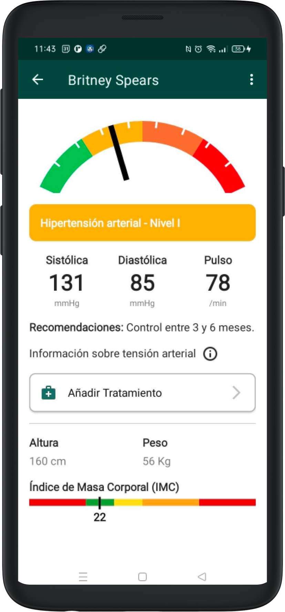
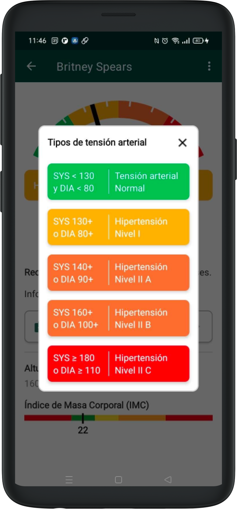
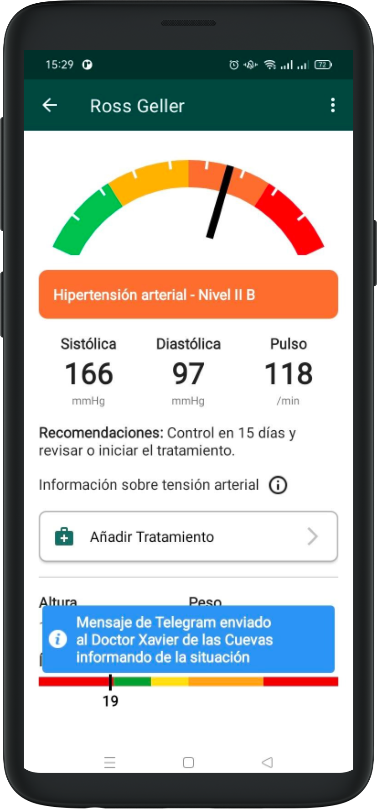
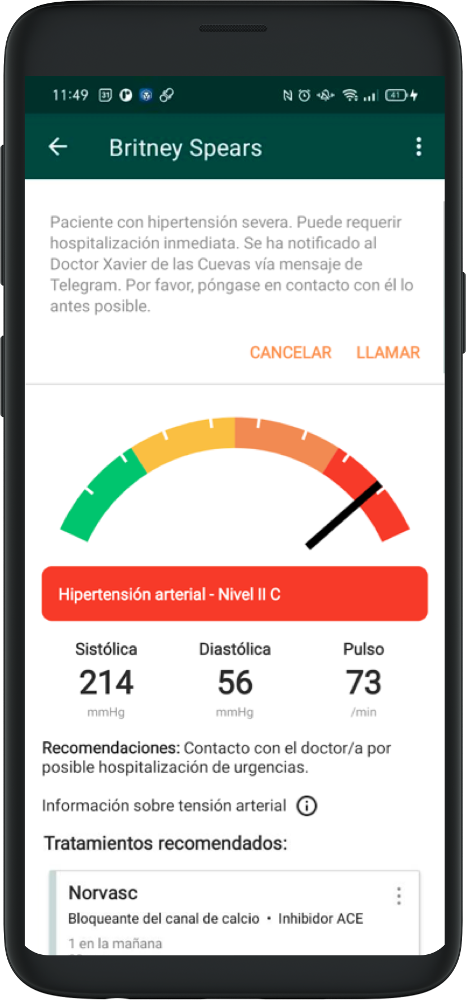

# Results

Depending on the average values of the visit, the level of arterial tension will be calculated.

To get more information, you can press on the icon that will open up with more detail. You can close it by tapping outside of the dialog, or on the X.

## Results Logic

If the patient falls under *Arterial tension – Normal*, with "Arterial hypertension - Level I* or with *Arterial hypertension - Level II A*, the system will simply show this information and corresponding recommendation, without involving any notification or doctor.

If the patient falls under *Arterial tension – Level II B*, the system will send a Telegram message to the assigned doctor, explaining the detection and the patient's information. 

If the patient falls under *Arterial tension – Level II C*, the Telegram message will be sent and you will also have the option to immediately call the doctor.

