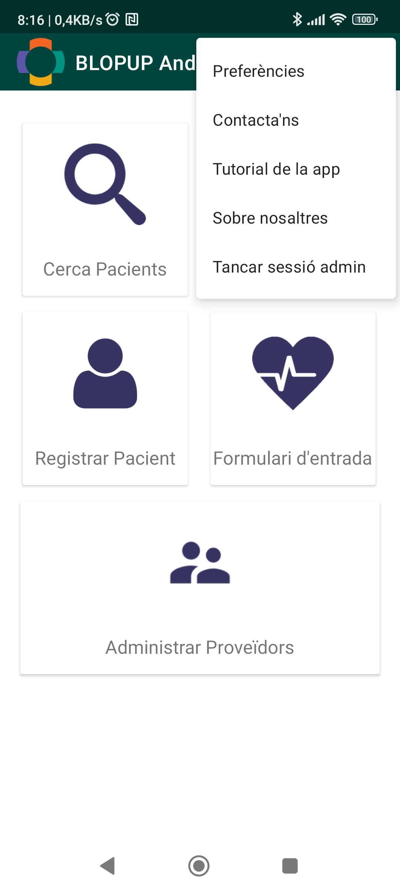
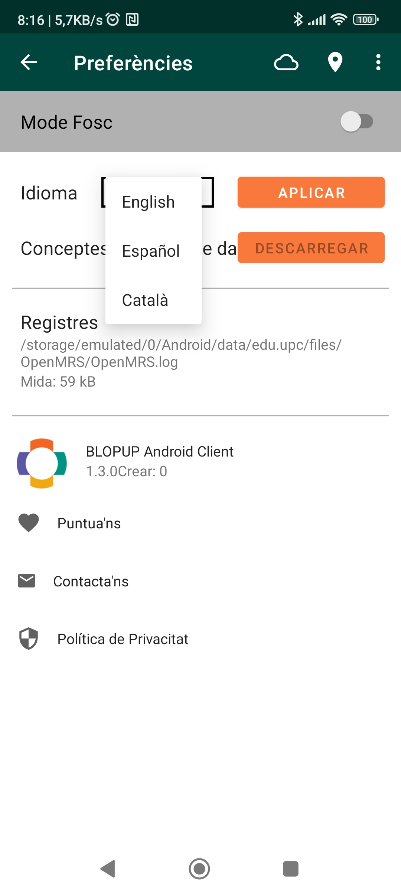

## Configuració de l'aplicació

Per accedir a la configuració de l'aplicació heu d'accedir al menú de la barra superior i un cop desplegat, a la secció **Preferències**.

### Idioma
L'aplicació admet diversos idiomes com català, castellà o anglès. Podeu canviar l'idioma al menú desplegable.

### Mode clar o mode fosc:
Podeu alternar entre el mode clar i el mode fosc de l'aplicació.

 

