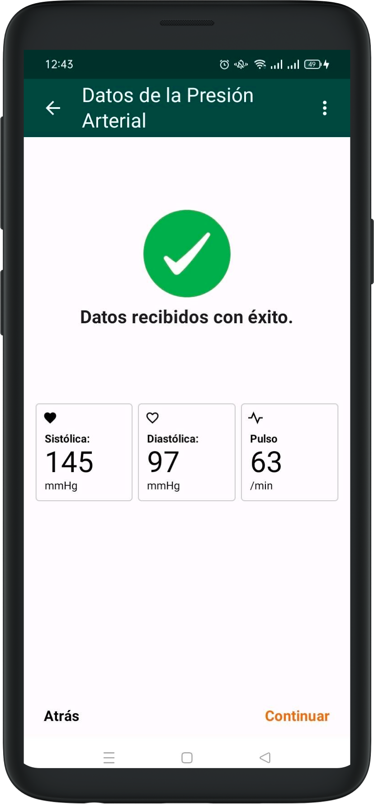
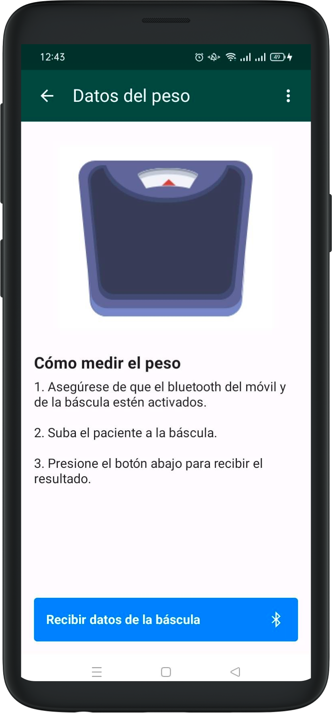
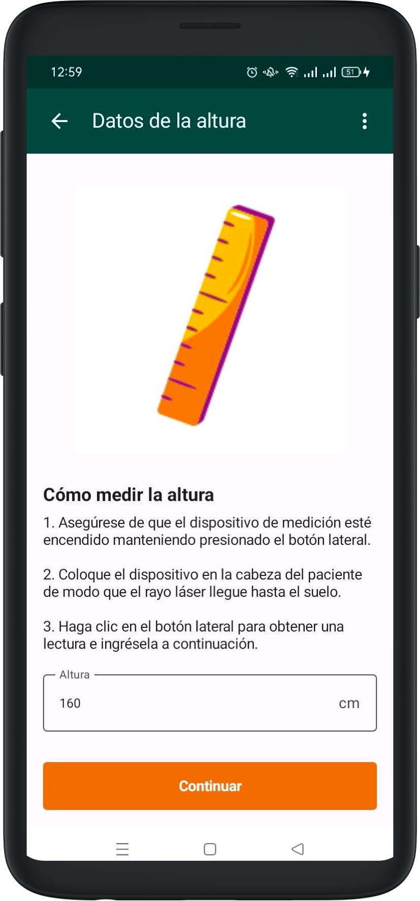

# Taking Vitals

## Arterial pressure

To record arterial pressure and pulse rate, first make sure bluetooth is active and the tensiometer is turned on.

Take the patient's pressure with the tensiometer, and when successful you will see a screen summarizing systolic and dyastolic pressure along with pulse rate.

The app provides instructions you can check before starting the visit by opening a dedicated section.

## Scale

To record the patient's weight, make sure the scale shows a bluetooth symbol as you weigh them.

The scale sends data automatically, but be sure to see the symbol. Once the weight has been recorded, the app will show a confirmation screen.

## Height

Height is input manually in the form, and is only required the first time a patient comes for a visit.

Take the measurement with the dedicated laser tool, and fill out the field once you have the right measurement.

During future visits, the height will be prefilled and may be edited if needed.

Once done with taking vitals, you will access the [Results](results.md) screen.
