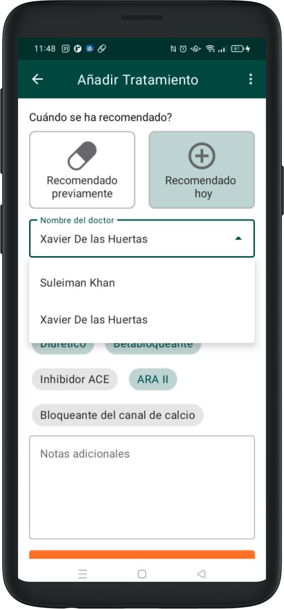
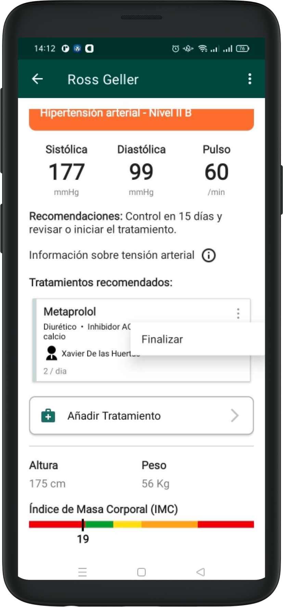

# Treatments

## Adding Treatments

In the results screen after completing the visit, there is a button saying "Add Treatment. Tapping on this section shows a dedicated form.

This form can be used to document any treatment we might recommend as part of the visit, or any previous treatment that the patient is already following, that we'd like to record for future visits.

This information will be saved and will affect some other parts of the application, when the patient comes back for future visits.

The form is made up of 4 sections:
1. Marking the treatment as pre-existing, or recommended during the visit.
2. Entering the name of the medicine and specifying the type of medicine (multiple types can apply)
3. There is also a free text field to add any reminder, note or explanation (dosage, frequency, duration...)

If the treatment has been recommended today, we will be able to specify the doctor that recommended the treatment.

When a patient has assigned treatments, we can also document their [adherence](adherence.md) to them.

## Editing Treatments

### Current treatments

As you come back to the results page after adding one or more treatments, each one has an icon on the upper right that opens a contextual menu. In this menu we can interact with each treatment.

We differentiate between treatments added today and treatments added from a previous recommendation.

If the treatment was added that same day, we have the option to edit it again in its corresponding form (for example, to correct any mistakes) or erase it completely.

### Previous treatments

A previous treatment cannot be edited, it can only be "Finalized". This will hide it from future visits while saving all the available previous information.

If for any reason you'd like to edit an ongoing treatment (like changing dosage or frequency), we recommend finalizing it and adding a new one with similar information.

When ending or finalizing a treatment, the corresponding card will turn transparent to represent that the operation was completed.
