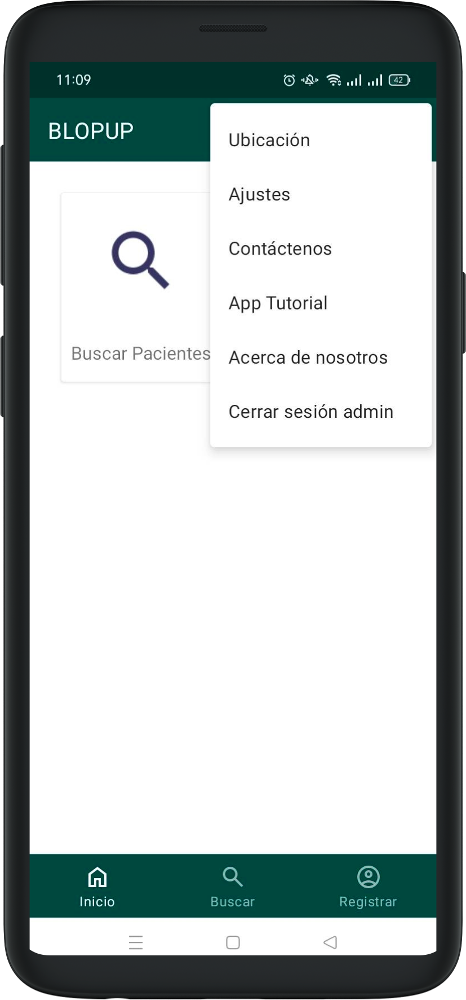

# Configuración

Para cambiar el idioma que se muestra en la aplicación deberá seleccionar el icono en la parte superior derecha de la pantalla, seleccionar Ajustes, abrir el desplegable de idiomas, seleccionar el idioma deseado y pulsar Aplicar. 

Para cerrar sesión, deberá seleccionar el icono en la parte superior derecha de la pantalla, seleccionar Cerrar sesión admin, y pulsar el botón naranja de Cerrar sesión. 
    

