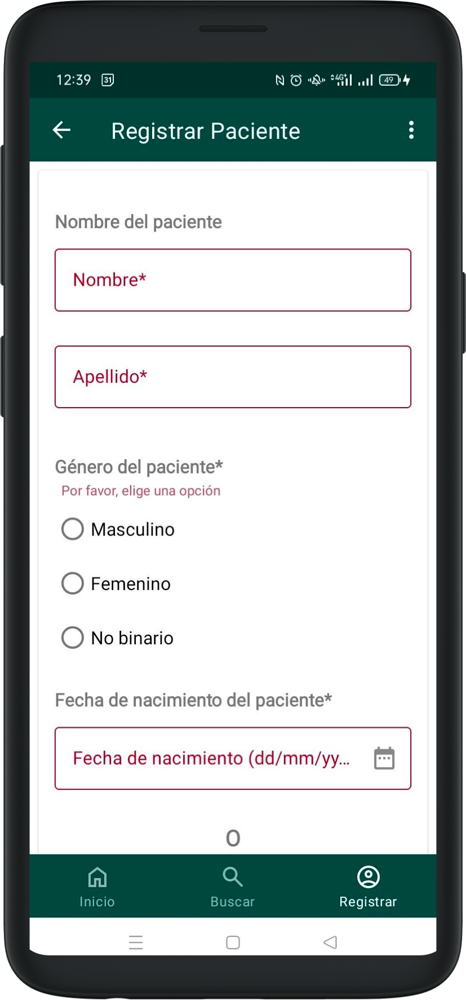

# Registrar Paciente

* Puede registrar un nuevo paciente en la sección Registrar paciente en el menú principal.

* En la pantalla de creación de paciente ha de introducir los datos de contacto básicos del paciente. Todos los datos son obligatorios y marcados en rojo. Al rellenar el formulario se activará el botón para confirmar la creación del paciente.

* Es posible ingresar la fecha de nacimiento o la edad estimada en caso de no tener una fecha concreta. 

## Grabar consentimiento

* Para poder registrar un paciente ha de grabar el consentimiento. Seleccione el idioma del paciente en el desplegable y pulse en Grabar consentimiento. 
* En la sección de grabación del consentimiento, habrá dos textos: uno en el idioma del móvil que explica lo que puede hacer en esa sección, y otro en el idioma del paciente seleccionado previamente con el consentimiento legal, que se reproducirá en voz alta una vez que presione el botón Grabar consentimiento.
* Durante la grabación del consentimiento, aparecerá el mensaje: Grabación en curso en el borde superior indicando que la grabación está en curso.
* Durante la grabación puede Pausar la misma y retomar cuantas veces guste. Para ello, ha de presionar en Pausar para que la grabación se detenga. Una vez que desee retomar, ha de pulsar en Continuar. Una vez que el paciente haya dado el consentimiento ha de presionar Detener y guardar grabación.
* Al volver a la pantalla de registro, el sistema mostrará el ícono       que indica que el consentimiento está completo. Si desea volver a grabarlo, pulse en Grabar nuevamente.
* Una vez completados los datos requeridos es posible pulsar en Enviar para poder registrar al paciente.

