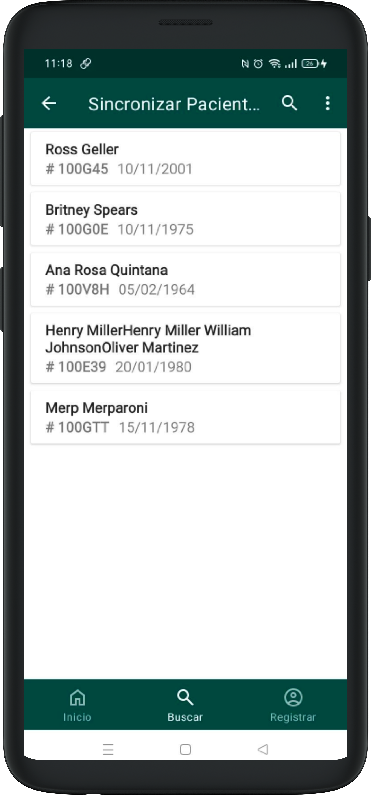

# Buscar paciente

* Si en lugar de crear un paciente sabe que este paciente ya ha sido creado, debe acceder a la sección Buscar Pacientes del menú principal.

* Si desea, puede hacer clic en el ícono 🔎 e ingresar el nombre del paciente que desea buscar. Puede buscar un nombre completo, o las primeras letras del mismo.

* Una vez que encuentra el paciente, haga clic en el nombre para ser redirigido a la ficha médica del mismo.

