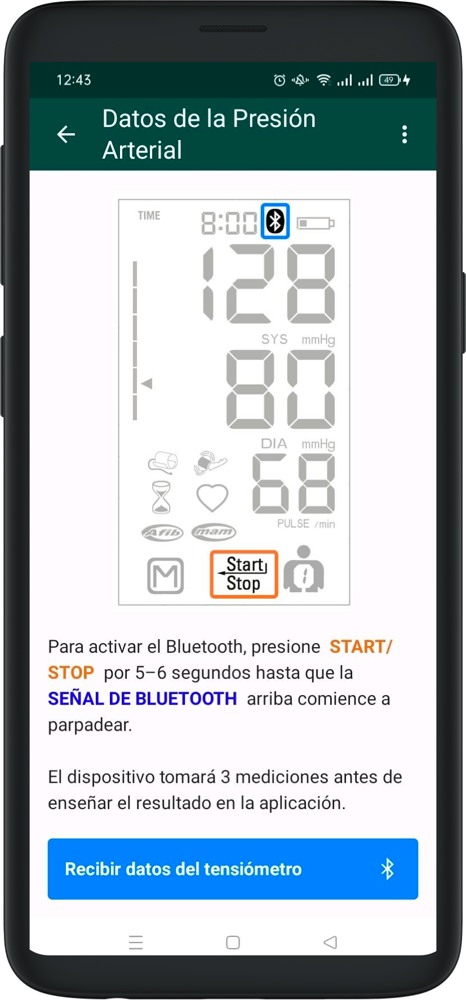

# Toma de vitales

## Presion Arterial

- Para poder registrar la presión arterial y el pulso, primero hay que activar manualmente el bluetooth en el tensiómetro.

- Luego ya puede tomar la presión del paciente y, al finalizar, aparecerá una pantalla de confirmación con los datos de la sistólica, diastólica y pulso. 

- La app provee unas instrucciones que se pueden leer en un apartado antes de iniciar la medición.

## Báscula

- Para tomar el peso, asegúrese también de que el símbolo del bluetooth aparezca en la báscula mientras pesa al paciente. 

El envío de datos desde la bascula es automático pero hay que corroborar que veamos el símbolo. Una vez tomado el peso, aparecerá una pantalla de confirmación.

## Altura

La altura deberá ingresarse de manera manual en el formulario si es la primera visita del paciente. 

Hay que tomar la medida con el aparato electrónico correspondiente y rellenar el campo una vez tengamos el valor.

En futuras visitas, el valor de la altura ya aparecerá escrito en el campo correspondiente y se podrá editar de ser necesario.

Una vez completada la toma de vitales, podremos ver la pantalla de [Resultados](results.md)

