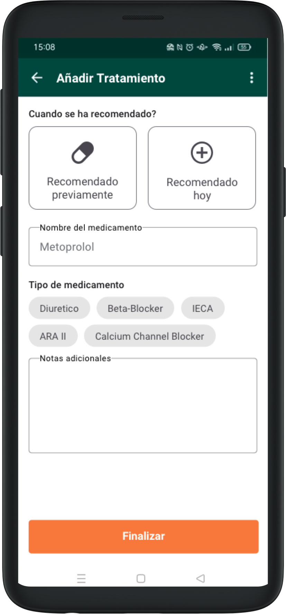
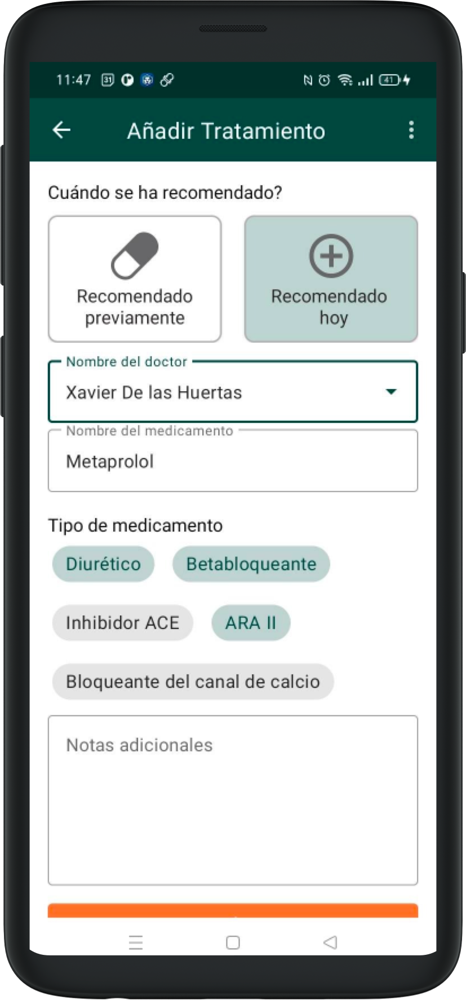
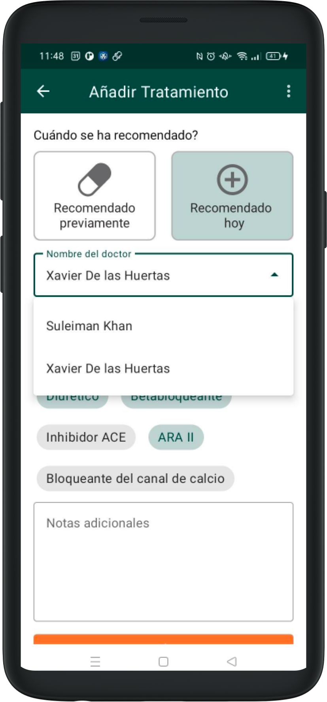
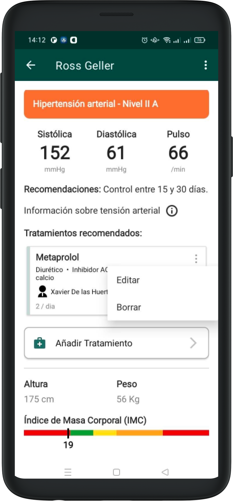
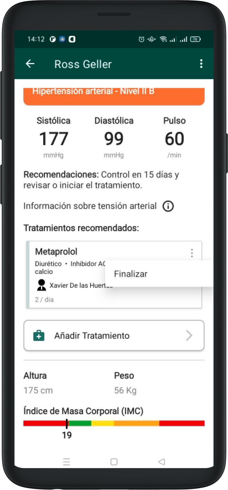

# Tratamientos

## Añadir Tratamientos

En la pantalla de resultados para la toma de vitales, hay un boton que dice “Añadir Tratamiento”. Clicando en este apartado entramos en un formulario específico. 

Este formulario se puede usar para documentar los tratamientos recomendados durante la visita, o tratamientos previos que el paciente ya está siguiendo y que queremos documentar para visitas futuras.

Esta información quedará grabada y afectará algunas partes de la aplicación cuando el paciente vuelva para visitas siguientes. 

El formulario consiste de 4 secciones:
En la primera marcamos el tratamiento como preexistente o recomendado durante la visita misma.
Introducimos el nombre del medicamento y podemos elegir todos los tipos de medicamento que aplican (selección multiple)
También tenemos un campo de texto libre para poder añadir cualquier tipo de recordatorio o explicación (dosis, frecuencia, duración del tratamiento…)

Si el tratamiento se recomienda hoy, tendremos un campo adicional donde apuntar el doctor que ha recomendado este tratamiento.

Cuando un paciente tiene tratamientos asignados podremos tambien documentar su [adherencia](adherence.md)

## Editar Tratamientos

### Tratamientos corrientes

Volviendo a la pantalla de resultados después de añadir uno o más tratamientos, cada tratamiento tiene un icono arriba a la derecha que despliega un menú contextual. En este menú podemos interactuar con cada tratamiento.

Diferenciamos como editar los tratamientos si se han añadido el mismo dia o si vienen de recomendaciones previas.

Si el tratamiento ha sido añadido este mismo día, tenemos las opciones de volver a editar el contenido en su formulario correspondiente (por ejemplo si hay errores) o borrarlo completamente.

### Tratamientos previos

Un tratamiento previo no se puede cambiar sino que se puede “Finalizar”. Esto lo esconderá de visitas futuras. Los datos previos quedarán guardados.

Si por cualquier razón se quiere editar un tratamiento ya en marcha (como cambiar la dosis o frecuencia), recomendamos finalizarlo y añadir uno nuevo con información parecida.

Al finalizar el tratamiento, la casilla correspondiente se pondrá transparente para representar el éxito de la operación.
