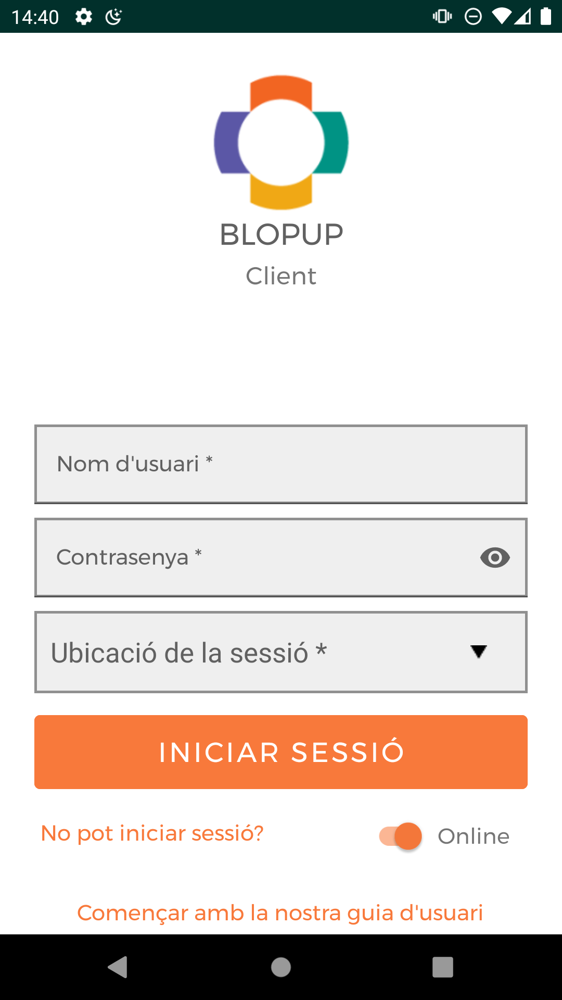

## Getting started

### Logging in
As you start the Blopup application, you are presented with the login screen. Complete this information:

* Username
* Password
* Location

Then, click Login button.

**Note:** To be able to login you must provide a location (e.g. "Inpatient Ward") for the session in the dropdown list.

 
 

