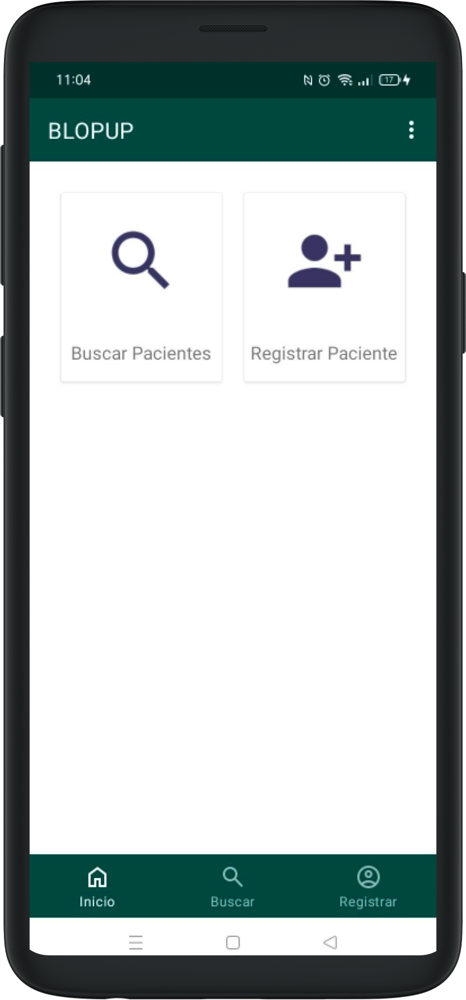

## Registering a New Patient

You can register new patients by clicking on the **Register Patient** button in the home menu.

#### 1. Entering Patient Details

After clicking **Register Patient**, you will be presented with a form to fill out the patient's basic information. You should input the patient's name, gender and birthdate or estimated age. When done, press "Submit" button.

[getting-started.md](..%2Fopenmrs-android-client-user-guide%2Fgetting-started.md)

If you did not enter the required details, you will be shown a message showing which fields are needed to be filled in order to complete registration.

After successfully adding a new patient, a summary regarding patient's data along with the patient photo is shown. From here you can start to interact with the patient, such as visiting the patient and entering biometrics data in the patient's vitals. 

You can also update the patient by heading to the pencil menu in the bottom.

#### 2. Adding Patient Photo

Another feature in the Android client during registration is the ability to upload a photo related to the patient. To do this, click on the camera icon. You can either take a photo now or choose an existing photo in your phone/tablet. 

#### 3. Finding Similar Patients

When registering a patient, similar existing patients will be shown to help you merge the patients. Similar patients are defined by patients having the same **names**, **gender**, **address** and **date of birth**. You can choose either to merge to an existing patient, or register the patient as new.