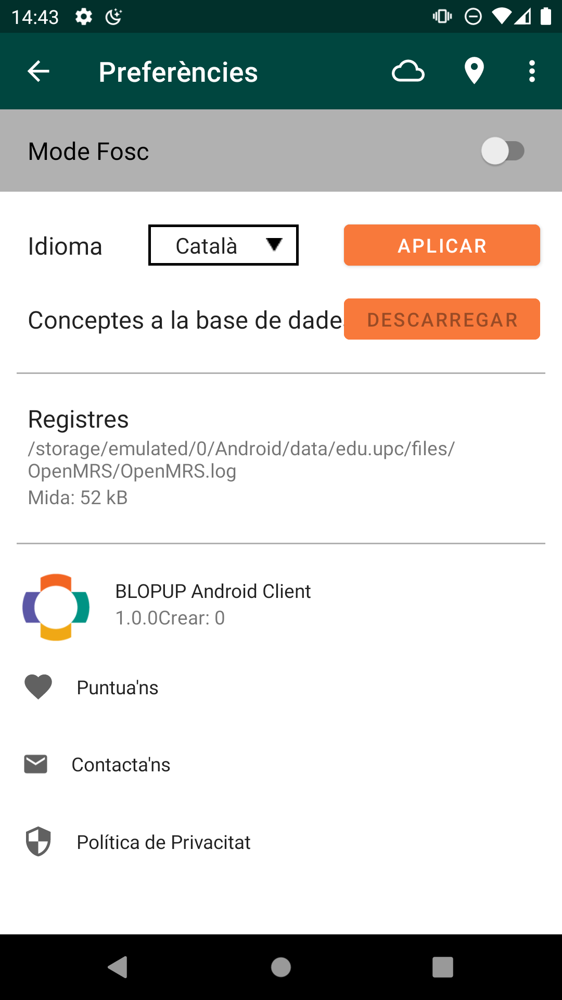

## Preferences

### Language
Blopup supports a few languages like Catalan, Spanish & English.
You can switch my selecting your preference then click on Apply.

### Dark or Light Mode:
Switch between dark mode and light by using the switcher at the top of the page.
 

[login]: assets/android_client_login_screen.jpeg

 

