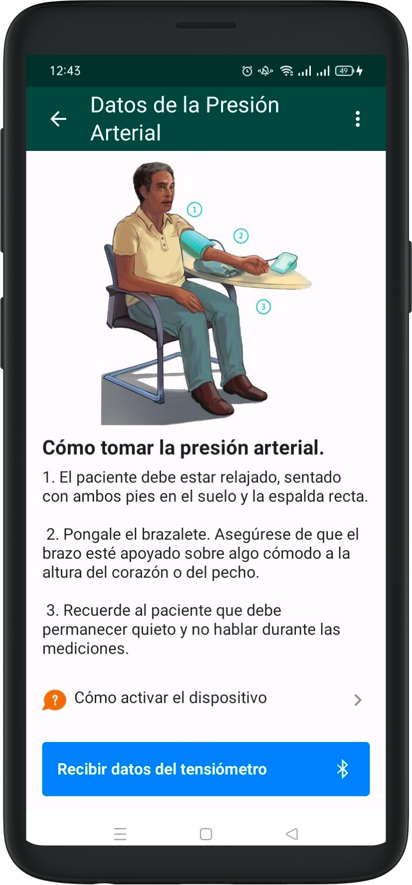

## Taking vitals

In order to take a patient's vitals, you have to enter the patient details screen and go to the visits tab.

There, you will see if the patient have any old or active visits. In case you have to start a new visit, click on the Play button in the top menu.

When you enter an active visit or create a new one, you will be presented with an empty screen with a text at the bottom asking you to take some vitals. You can click on the "SELECT" button.

The form to take vitals will open. Here you have to click on the "Rebre dades del tensiòmetre" button to take the blood pressure measurements from the patient, and then click on the "Rebre pes de la bàscula" to take the weight from the scale. The height of the patient can be manually introduced on the "Height" text box.

This is the screen for taking blood pressure measurements from the blood pressure device:

This is the screen for taking the weight from the scale:

Once you are finished taking the patient's measurements, when you click on the "SEND" button, you will be presented with this screen, showing the measurements you just took:

